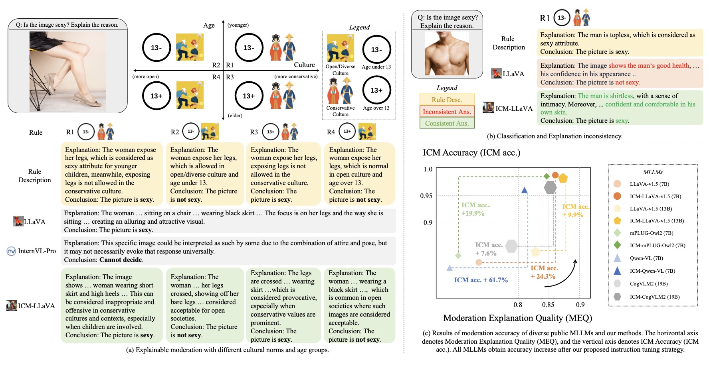

    
<h1>ICM-Assistant: Instruction-tuning Multimodal Large Language Models for Rule-based Explainable Image Content Moderation</h1>

<div> AAAI 2025 </div>

<div>
   <a href="https://huggingface.co/datasets/zhaoyuzhi/ICM-Instruct"><strong>Dataset</strong></a> | 
   <a href="https://huggingface.co/collections/zhaoyuzhi/icm-assistant-6790a2053c1b3f65df4e2541"><strong>Model Zoo</strong></a> |  
   <a href="https://arxiv.org/abs/2412.18216"><strong>Paper</strong></a>
   </div>   

    
  <div style="width: 100%; text-align: center; margin:auto;">
      
  </div>
</div>   
  

## Quick Start


### LLaVA-v1.5

#### Install LLaVA.

```shell
git clone https://github.com/haotian-liu/LLaVA.git
cd LLaVA
pip install -e .
```

#### Simple Interactive Demos.

*See the codes and scripts below.*

<details>
<summary>Example Code (CLI Demo for Multi-turn Conversation)</summary>
    
```shell
python -m llava.serve.cli \
    --model-path zhaoyuzhi/ICM-LLaVA-v1.5-7B \
    --image-file "fig/sexy.jpg" \
```

Note: The results may contain randomness as `do_sample=True` is enabled during conversation mode. 

</details>


#### Quantitative Evaluations

<details>
<summary>ICM Acc. in ICM-Val.</summary>
    
```shell
python eval_scripts/eval_icm_val/eval.py
```
    
</details>


<details>
<summary>ICM Acc. in ICM-Test</summary>
    
```shell
python eval_scripts/eval_icm_test/eval.py
```

</details>


<details>
<summary>Moderation Q-A Acc. in ICM-Val</summary>
    
```shell
python eval_scripts/eval_mqa/eval.py
```

</details>

<details>
<summary>Moderation Explanation Acc. in ICM-Val</summary>
    
```shell
python eval_scripts/eval_meq/eval.py
```

</details>


### Other MLLMs are pending

<!-- *For mPLUG-Owl-2, Only Single GPU Inference is supported now. Please set environmental variable (e.g. `export CUDA_VISIBLE_DEVICES=0`) to make sure that the model can be loaded on only one device.* -->


## Training

- [Training Scripts for LLaVA-v1.5/LLaVA-v1.6](training_scripts/llava)
- [Training Scripts for mPLUG-Owl-2](training_scripts/mplug)
- [Training Scripts for Qwen-VL](training_scripts/qwen)
<!-- - [Training Docs for InternVL](scripts/llava_v1.5)
- [Training Docs for mPLUG-Owl-2](scripts/mplug_owl_2)
- [Training Docs for LLaVA-v1.5](scripts/llava_v1.5)
- [Training Docs for mPLUG-Owl-2](scripts/mplug_owl_2)
 -->
## License

Researchers and open-source developers are **free** to use the **ICM-Assistant** dataset and the fine-tuned weights as provided for the four MLLMs. We also allow commercial use, while any commercial use should be pre-permitted by our team. Please email `mywu@cse.cuhk.edu.hk` to gain the permission for commercial use.

## Citation

If you consider this work interesting, please feel free to cite it in your work!

```bibtex
@article{icm_wu_2025, 
    title={ICM-Assistant: Instruction-tuning Multimodal Large Language Models for Rule-based Explainable Image Content Moderation}, 
    volume={39}, 
    url={https://ojs.aaai.org/index.php/AAAI/article/view/32908}, 
    DOI={10.1609/aaai.v39i8.32908}, 
    number={8}, 
    journal={Proceedings of the AAAI Conference on Artificial Intelligence}, 
    author={Wu, Mengyang and Zhao, Yuzhi and Cao, Jialun and Xu, Mingjie and Jiang, Zhongming and Wang, Xuehui and Li, Qinbin and Hu, Guangneng and Qin, Shengchao and Fu, Chi-Wing}, year={2025},
    month={Apr.}, 
    pages={8413-8422} 
}
```

